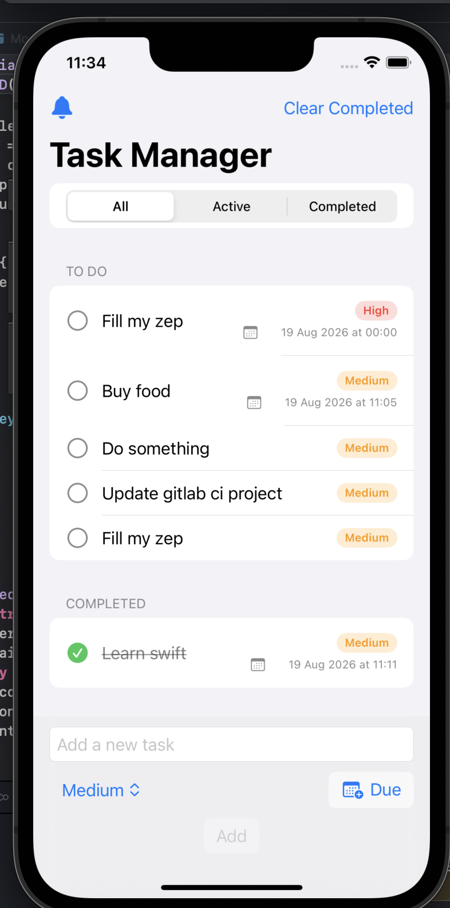

# TaskManager

TaskManager is a SwiftUI todo-style iOS app focused on clean architecture, good Swift practices, and beginner-friendly code.

## App Screenshot

## Features

- Add, complete, and delete tasks
- Task priorities: Low, Medium, High
- Filters: All, Active, Completed
- Optional due date and due time per task
- Local notification reminders for upcoming tasks
- Clear all completed tasks
- Local persistence using JSON + UserDefaults

## Tech Stack

- Swift
- SwiftUI
- UserNotifications (local reminders)
- UserDefaults for lightweight local storage

## Getting Started

1. Open `TaskManager.xcodeproj` in Xcode.
2. Select the `TaskManager` scheme.
3. Choose an iOS Simulator.
4. Build and run.

## Notifications

- Tap `Enable Reminders` in the app toolbar.
- When a task has a due date/time, a local notification is scheduled.
- Completed tasks do not trigger reminders.

Detailed implementation notes, diagrams, and manual code blocks are in [docs/notifications-and-flow.md](docs/notifications-and-flow.md).

## Persistence Strategy

This project currently uses a lightweight persistence layer:

- `TaskStoring` protocol abstracts storage
- `UserDefaultsTaskStore` handles encode/decode of tasks

This keeps the app simple while remaining easy to migrate later to SwiftData or Core Data.

## Testing

Unit tests live in `TaskManagerTests/` and cover core `TaskListViewModel` behavior such as:

- Adding tasks
- Filtering tasks
- Clearing completed tasks

## License

This project is licensed under the MIT License. See `LICENSE`.
