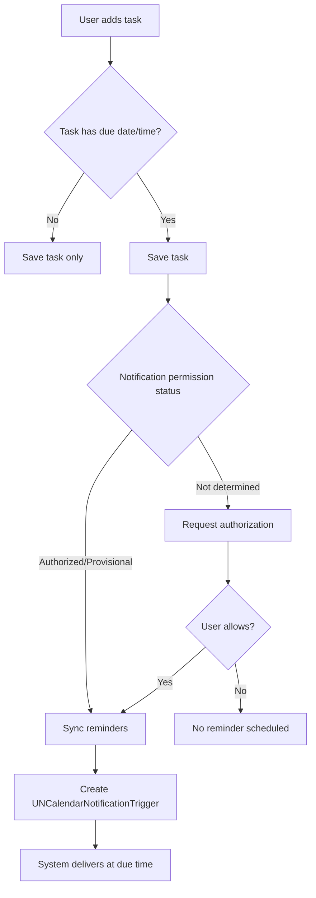
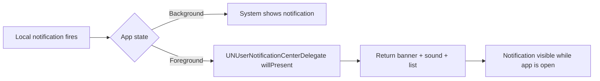
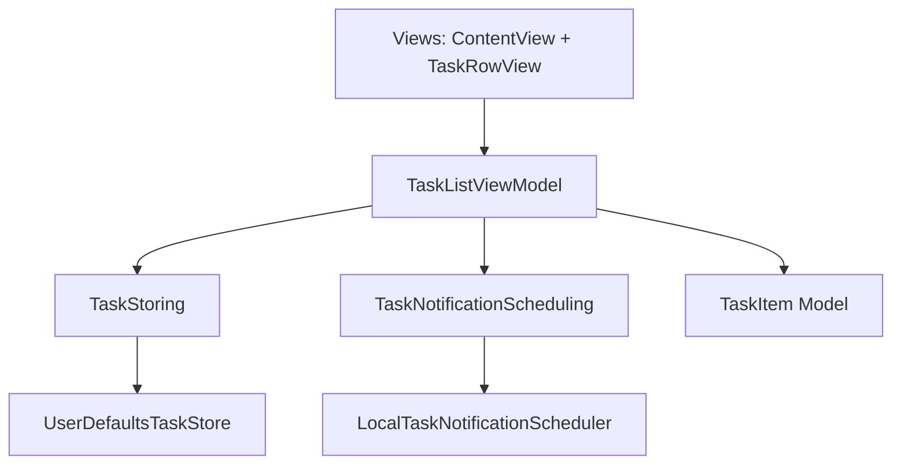

# Notifications And App Flow

This document explains the reminder fix, the runtime flow, and the architecture flow.

## What Was Fixed

If a due time passed while the app was open, iOS could suppress notification UI unless foreground presentation was explicitly enabled.

To fix that, we added:

- A notification center delegate that allows banner, sound, and list while app is active.
- App-level delegate wiring so the notification delegate is registered at launch.
- A view-model improvement to request permission when adding a dated task and authorization has not been decided yet.

## Reminder Delivery Flow



## Foreground Notification Flow



## Architecture Flow



## Code You Can Type Manually

This is the delegate used to make reminders visible while the app is open:

```swift
import Foundation
import UserNotifications

final class NotificationCenterDelegate: NSObject, UNUserNotificationCenterDelegate {
    func userNotificationCenter(
        _ center: UNUserNotificationCenter,
        willPresent notification: UNNotification,
        withCompletionHandler completionHandler: @escaping (UNNotificationPresentationOptions) -> Void
    ) {
        completionHandler([.banner, .sound, .list])
    }
}
```

This is the app launch wiring that activates that behavior:

```swift
import SwiftUI
import UserNotifications

final class AppDelegate: NSObject, UIApplicationDelegate {
    private let notificationDelegate = NotificationCenterDelegate()

    func application(
        _ application: UIApplication,
        didFinishLaunchingWithOptions launchOptions: [UIApplication.LaunchOptionsKey: Any]? = nil
    ) -> Bool {
        UNUserNotificationCenter.current().delegate = notificationDelegate
        return true
    }
}
```
